<h1 align="center">
  <a href="https://pointeract.consensia.cc">
    
  </a>
  <br>
</h1>

<h4 align="center"> Modern, lightweight, robust and extensible user interaction resolver </h4>

<p align="center">
  <a href="https://github.com/hesprs/pointeract/actions">
    
  </a>
  <a href="https://codecov.io/github/hesprs/pointeract">
    
  </a>
  <a href="https://www.codefactor.io/repository/github/hesprs/pointeract">
    
  </a>
  <a href="https://pointeract.consensia.cc">
    
  </a>
  <a href="https://www.npmjs.com/package/pointeract">
    
  </a>
  <a href="https://snyk.io/test/npm/pointeract">
    
  </a>
  <a href="https://bundlephobia.com/package/pointeract">
    
  </a>
  
  
</p>

<p align="center">
  <a href="#whats-pointeract">Introduction</a> •
  <a href="#advantages">Advantages</a> •
  <a href="#get-started">Get Started</a> •
  <a href="#currently-supported-interactions">Features</a> •
  <a href="#how-pointeract-stands-out">Comparison</a> •
  <a href="#get-involved">Get Involved</a> •
  <a href="#copyright-and-license">License</a>
</p>

## What's Pointeract?

Pointeract is a tiny utility library focusing on one thing - handling user interactions with DOM elements. It is fully typed, small, and easy to use. You need to bind your DOM elements, load some modules, and it will start monitoring user interactions and dispatch events like `trueClick` and `pan` with data.

It is built in an extensible architecture with base bundle size only **1KB** minified + gzipped, functionalities come from also byte-sized modules. It's fully **tree-shakable**, the fewer modules you use, the smaller your bundle is.

Access our documentation [in the website](https://pointeract.consensia.cc/).

## Advantages

- **🐣 Tiny**: With base **1KB** minified and gzipped, **1-2KB** for normal usage.
- **💪 Robust**: Excels at complex gestures where most interaction libraries fail, [Why?](https://pointeract.consensia.cc/development/testing#chaotic-testing)
- **🧩 Extensible**: Extend Pointeract effortlessly via our module API.
- **🔌 Flexible during Runtime**: Options are updated reactively. Stop/start any module during runtime.
- **🛡️ Safe**: Not modifying the DOM (except the `PreventDefault` module). Meticulous clean up prevents memory leaks.

## Get Started

Install Pointeract using your favorite package manager:

```sh
# npm
$ npm add pointeract

# pnpm
$ pnpm add pointeract

# yarn
$ yarn add pointeract

# bun
$ bun add pointeract
```

Or include the following lines directly in your HTML file:

```html
<script type="module">
	import { Pointeract } from 'https://unpkg.com/pointeract/dist/index.js';
</script>
```

This link ships the latest ESM version by default, to access CJS version or earlier versions, try using a different URL like:

```html
<script src="https://unpkg.com/pointeract@1.0.0/dist/index.cjs"></script>
```

The link above ships version 1.0.0 in CJS.

## Currently Supported Interactions

- **Click (Double Click, Triple Click, Quadruple Click, Any Click)**
- **Drag**
- **Pan and Zoom via Mouse Wheel (`ctrl`/`shift` key binding, touchpad support)**
- **Pan and Zoom via Multitouch (Pan, Pinch)**

Those interactions are shipped via modules, which can be composed from a single drag-and-drop to a canvas app.

Missing your desired interaction? [Write your own module](https://pointeract.consensia.cc/development/custom-modules)!

## How Pointeract Stands Out?

There're already plenty of interaction libraries out there, most famous ones are `Interact.js` and `Hammer.js`, but Pointeract is different.

| Criteria                                                                                     |                      Pointeract                       |     [Hammer.js](https://hammerjs.github.io)      |        [Interact.js](https://interactjs.io)         |
| :------------------------------------------------------------------------------------------- | :---------------------------------------------------: | :----------------------------------------------: | :-------------------------------------------------: |
| Written in TypeScript?                                                                       |                          ✅                           |                        ❌                        |                         ✅                          |
| Tree-shakeable?                                                                              |   [✅](https://bundlephobia.com/package/pointeract)   | [❌](https://bundlephobia.com/package/hammerjs)  |  [❌](https://bundlephobia.com/package/interactjs)  |
| Bundle Size (Minified + Gzipped)                                                             | 👑 [2KB](https://bundlephobia.com/package/pointeract) | [7KB](https://bundlephobia.com/package/hammerjs) | [28KB](https://bundlephobia.com/package/interactjs) |
| Last Updated                                                                                 |                👑 Actively Maintained                 |                       2015                       |                        2023                         |
| Features                                                                                     |               Pointer and Wheel Related               |                 Pointer Related                  | 👑 Pointer and Wheel Related + Comprehensive Utils  |
| Robust? (See [Testing](https://pointeract.consensia.cc/development/testing#chaotic-testing)) |                          ✅                           |                 ❌ Element Jerks                 |         ❌ Element Ignores the Second Touch         |
| Extensible?                                                                                  |                          ✅                           |                        ❌                        |                         ❌                          |

## Get Involved

This project welcomes anyone that have ideas to improve it.

- [Open a pull request](https://github.com/hesprs/pointeract/compare) for a new module, event standard, documentation update, and so on.
- [Open an issue](https://github.com/hesprs/pointeract/issues/new) if you find a bug.
- [Start a new thread in Discussions](https://github.com/hesprs/pointeract/discussions/new) if you have feature requests or questions, please avoid posting them in Issues.
- [Report a vulnerability](https://github.com/hesprs/pointeract/security/advisories/new) if you find one, please do not disclose it publicly.

## Copyright and License

Copyright ©️ 2025-2026 Hesprs (Hēsperus) | [Apache License 2.0](https://www.apache.org/licenses/LICENSE-2.0.html)
